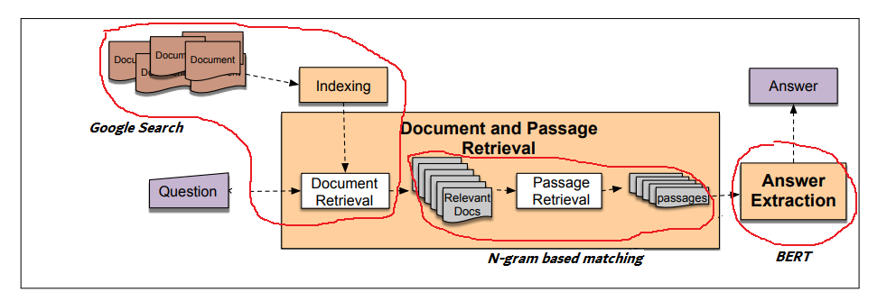

### Question Answering with Transformer ( Not Yet Finished)

- Question: **What is Graph Neural Network?**
- Answer: **Graph Neural Network (GNN) is a class of ANN for processing data that can be presented as graphs. The latest research work related to GNN includes [1] … [2] … [3] …**
### Install prerequisites (python3)
pip3 install -r path/requirements.txt 
### Download pre-train model 
Link: [https://drive.google.com/open?id=1ml-Qwv4yHxepp852N-aL0U5iZzqLNZ4B](https://drive.google.com/file/d/1x0-2fBnoXKXU5Gr4zTzvprRo6-KaN9D4/view?usp=share_link)
- After that, extract and put all files into the "resources" directory

###  Architecture Overview
 - Question Answering based IR - Speech and language processing (daniel jurafsky)
 - https://web.stanford.edu/~jurafsky/slp3/24.pdf
 - For better understanding: Open notebook file --> change the question --> run line by line
 

